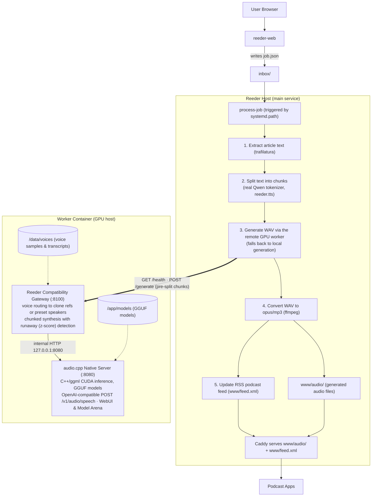

# Reeder

A personal TTS RSS service that converts articles and text to audio, served as a podcast feed.

> **Be advised:** Cobbled together by various LLMs. Claude, take the wheel!

## Overview



Jobs are dropped as JSON files into `inbox/`, processed one at a time, and the
resulting audio is converted to the configured format (`opus` or `mp3`), added
to the generated files directory, and served as an RSS podcast feed. TTS
synthesis runs on a remote GPU worker ([audio.cpp](https://github.com/0xShug0/audio.cpp))
when configured, falling back to local generation —
see [docs/audiocpp.md](docs/audiocpp.md) for the worker playbook.

## Quick Start

```bash
# Install
./install.sh

# Configure (edit base_url and voice settings)
sudo vim /var/lib/reeder/config.toml

# Add a voice file (WAV audio + TXT transcript)
sudo cp your-voice.wav /var/lib/reeder/voices/default.wav
sudo cp your-voice.txt /var/lib/reeder/voices/default.txt
sudo chown -R reeder:reeder /var/lib/reeder/voices/

# Submit a test job
echo '{"type":"text","text":"Hello world","title":"Test"}' | \
  sudo -u reeder tee /var/lib/reeder/inbox/$(date +%s)-test.json

# Monitor
journalctl -u reeder -f
```

## Job Submission

### Via helper scripts

```bash
# URL (fetches and extracts article text)
submit-url https://example.com/article "Optional Title"

# Direct text
submit-text "My Notes" "Text to convert..."
echo "Piped text" | submit-text "From Stdin"
```

### Manual job files

Drop a JSON file in `/var/lib/reeder/inbox/`:

```json
{
  "type": "url",
  "url": "https://example.com/article",
  "title": "Article Title"
}
```

See [docs/job-format.md](docs/job-format.md) for full schema.

## Monitoring

```bash
# Current status
reeder-status

# Live status file
tail -f /var/lib/reeder/var/status.txt

# System logs
journalctl -u reeder -f
```

## Configuration

Edit `/var/lib/reeder/config.toml`:

- **base_url**: Your Tailscale hostname (e.g., `https://myserver.tail1234.ts.net/reeder`)
- **default_voice**: Voice file for TTS (place in `voices/` directory)
- **audio_format**: `opus` (smaller) or `mp3` (more compatible)
- **temperature**: TTS expressiveness (0.0-1.0)

Local machine/network settings should go in an override file, not `config.toml`.

- Base config: `config.toml` (tracked)
- Local overrides: `config.override.toml` (ignored)
- Example template: `config.override.toml.example`

At runtime, `config.override.toml` is merged over `config.toml` automatically.

## RSS Feed

Subscribe to `https://your-hostname/feed.xml` in any podcast app:
- Pocket Casts
- Overcast
- AntennaPod
- Apple Podcasts

## Architecture

- **systemd.path**: Watches inbox for new job files
- **systemd.service**: Processes one job at a time
- **process-job**: Extracts article text (trafilatura), splits it into
  token-bounded chunks, and dispatches to the remote TTS worker, falling back
  to local generation when unavailable
- **Remote worker (audio.cpp)**: Native ggml/CUDA inference of GGUF TTS models
  (Qwen3-TTS voice cloning, Kokoro presets, ...) behind the compatibility
  gateway, with chunked synthesis and runaway-chunk detection
- **ffmpeg**: Converts generated WAV to the configured audio format
- **Caddy**: Serves audio files and the RSS podcast feed over HTTPS

## Development

```bash
# Install dependencies
uv sync

# Run locally (from repo directory)
export REEDER_CONFIG=config.dev.toml

# Submit and process a job
bin/submit-url https://example.com/article "Test Article"
uv run bin/process-job

# Update feed manually
uv run bin/update-feed

# Check status
bin/reeder-status
```

## Requirements

- Python 3.13 (required for onnxruntime compatibility)
- uv (Python package manager)
- ffmpeg
- sox
- curl
- pup (for custom CSS selectors)
- Caddy (optional, for HTTPS)

## License

MIT License - see [LICENSE](LICENSE) file for details.
